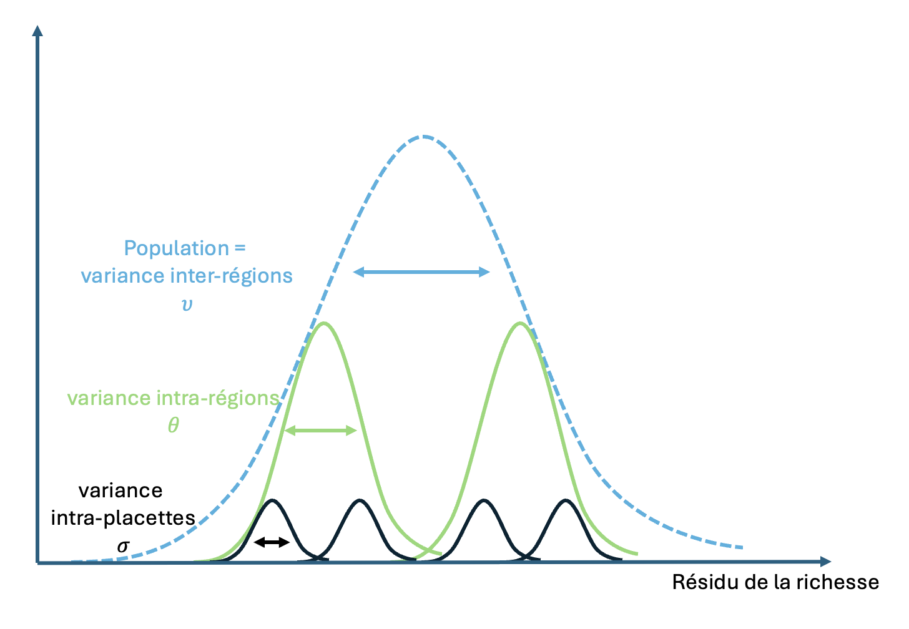
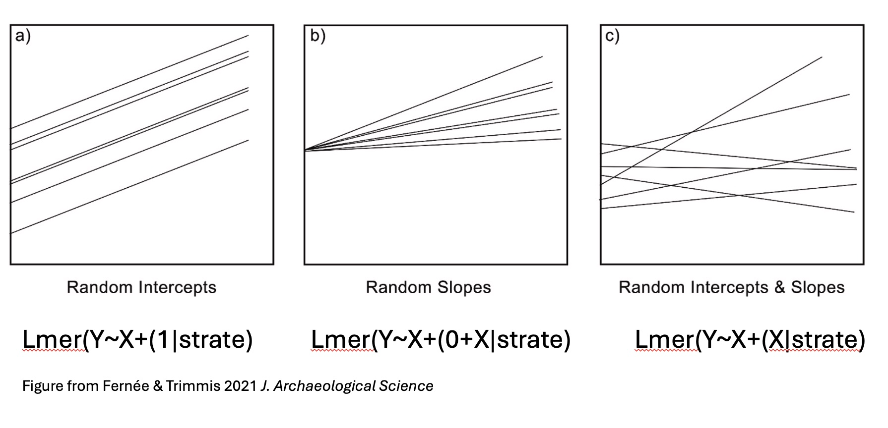
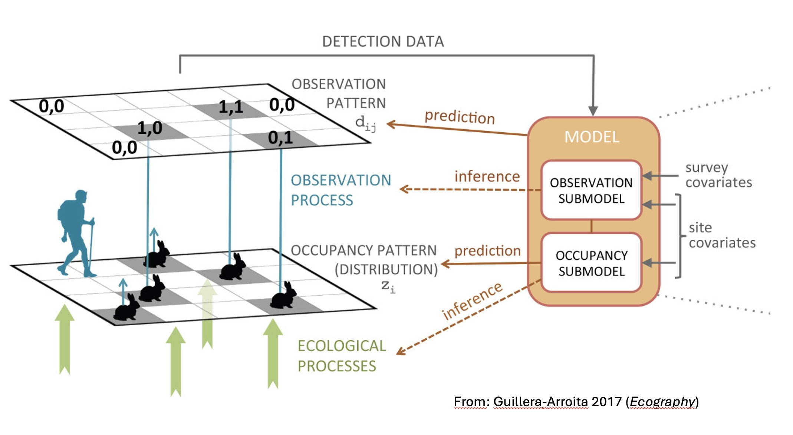
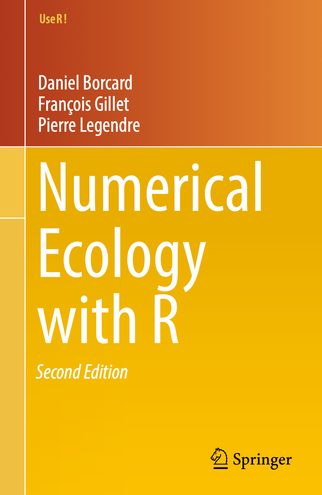
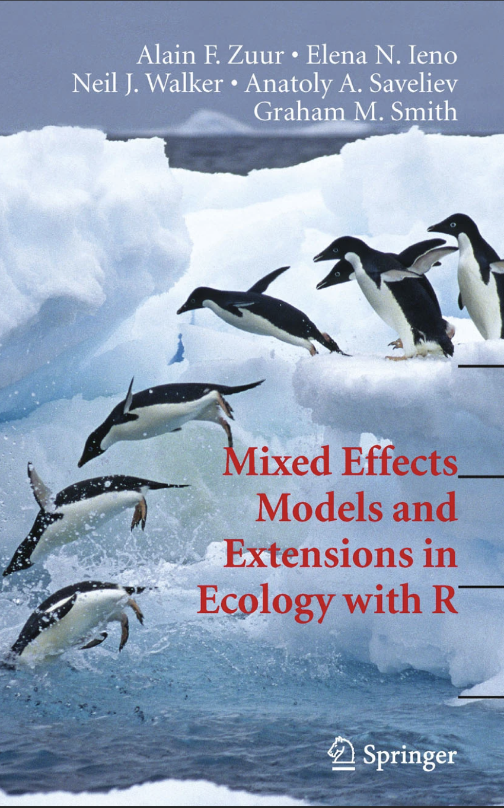

<style>
  .col2 {
    columns: 2 200px;         /* number of columns and width in pixels*/
    -webkit-columns: 2 200px; /* chrome, safari */
    -moz-columns: 2 200px;    /* firefox */
  }
  .col3 {
    columns: 3 100px;
    -webkit-columns: 3 100px;
    -moz-columns: 3 100px;
  }
slides > slide {
  overflow-x: auto !important;
  overflow-y: auto !important;
}
</style>

# Objectifs du cours

- Écrire formellement un modèle mixte (lmm et glmm)
- Interpréter un modèle mixte
- Évaluer un modèle mixte
- Cas particulier : modèle d'occupation
- Recommandations pour les modèles mixtes et conclusion

# Introduction

- Quand on envisage une stratégie d'échantillonnage en écologie, le plus souvent on utilise des blocs de mesures : sites de mesures (placette, transect…), mesures répétées (plusieurs années de mesures ou plusieurs mesures par individu), régions naturelles ou biogéographiques.

- Ces structures par blocs nuisent à l’estimation des paramètres de modèles linéaires et doivent donc être prises en compte

- De plus, pour diverses raisons inhérentes aux contraintes du travail de terrain, les relevés de terrain sont souvent hétérogènes, ce qui résulte dans des désiquilibres entre blocs. Ceci peut être un obstacle à l’inférence (certains points captent la variance).

Par conséquent, dans une démarche analytique qui intègre une structure croisée ou emboîtée (e.g. spatio-temporel), il est utile :

- D'intégrer une structure hiérarchique au sein d'un modèle afin de permettre une inférence populationnelle.

- Évaluer si les données que l'on a récolté sont compatibles avec cette approche : bien réfléchir à la stratégie d'échantillonnage et au protocole de relevés en amont !

### Recommandation générale (rappel)

N'oubliez pas en amont de toute analyse de bien identifier les trois éléments suivants (vaut pour toute approche statistique) :

- Définir la population statistique.

- Définir l'échantillon.

- Définir l'unité d'échantillonnage.


# Rappels LM et GLM

On simule un jeu de données selon le scénario suivant : 

- 20 strates
- Une variable réponse de moyenne, distribution normale de moyenne 5 et sd de 10
- Une variable explicative “Predicteur”, distribution normale de moyenne 0 et sd de 1
- 30 points de mesure par strate
- un résidu non structuré, distribution normale de moyenne 0 et sd de 1

##

Table données simulées :
```{r , echo=F, eval=T, message=FALSE}
library(tidyverse)
library(lme4)

#simuler un jeu de données ####
## 20 strates ####
strate <- paste("S", 1:20, sep = "")

## moyenne de l'intercept de chaque strate ####
mean <- rnorm(20, 5, 10)

## pente unique pour toutes les strates ####
alpha <- -5

## une variable explicative mesuree de la meme maniere dans toutes les strates, avec 30 points par bloc ####
Var <- rnorm(30, 0, 1)

## un residu non structure avec une certaine variance ####
eps <- rnorm(30, 0, 1)

## on genere la variable de reponse dans chaque strate ####
var.rep <- NULL
for(i in 1:length(mean)) {
  y = mean[i] + alpha * Var + eps
  var.rep = c(var.rep, y)
}

data.sim <- tibble(Reponse = var.rep,
                      Strate = factor(rep(strate,each=30)),
                      Predicteur = rep(Var, times = length(mean)))

data.sim
summary(data.sim)
```

##

On écrit un modèle linéaire pour évaluer l'influence de la variable explicative X sur la variable réponse Y (modèle “naïf”)

\[Y \sim N(\mu, \sigma^2)  \]


\[ \mu = \alpha + \beta \times X  \]

##

Évaluation graphique du modèle :

```{r , echo=F, eval=T, message=FALSE}
##Modele naif ####
mod.naif <- lm(data = data.sim, Reponse ~ Predicteur)
par(mfrow=c(2,2))
plot(mod.naif) #evaluation graphique du modele
```

##

Résidus moyens par strate :

```{r , echo=F, eval=T, message=FALSE}
par(mfrow = c(1,1))
boxplot(residuals(mod.naif)~data.sim$Strate)
```

On remarque une dépendance des résidus à la variable.

##

```{r , echo=F, eval=T, message=FALSE}
coef(mod.naif)
confint(mod.naif)
```

<div class="col2">

Vrai intercept :

```{r , echo=F, eval=T, message=FALSE}
###vrai intercept : 5.2####
moy.sim.a <- mean(mean)
moy.sim.a
```


Vrai intervale de confiance :

```{r , echo=F, eval=T, message=FALSE}
###vrai intervale de confiance : [-0.13 – 10.61] ####
ic.sim.a <- paste("[",(round(mean(mean) - 1.96 * (sd(mean)/sqrt(length(mean))),2)), "–",
                 round(mean(mean) + 1.96 * (sd(mean)/sqrt(length(mean))),2), "]")
ic.sim.a

#l'intervale de confiance du modèle est trop resserre (erreur de type 1 importante, on rejette H0 alors qu'elle est vraie)
#mais l'estimate (pente) est bonne.
```
</div>


Bilan : La pente est bonne, mais l'intervale de confiance du modèle est trop resseré (erreur de type 1 importante, on rejette H0 alors qu'elle est vraie).


Comment améliorer le modèle ?

## On ajoute un effet strate au modèle : 

\[ \mu = \alpha + \beta \times X + \gamma \times Strate \]

##

```{r , echo=F, eval=T, message=FALSE}
##Modele 2 on ajoute l'effet strate ####
mod.add <- lm(data = data.sim, Reponse ~ Predicteur + Strate)
head(confint(mod.add), n = 4)
#                 2.5 %      97.5 %
#(Intercept)   3.999399   4.4416045
#Predicteur   -5.558002  -5.4233287
#StrateS10    28.121777  28.7469683
#StrateS11    -1.303721  -0.6785298
#StrateS12   -30.353661 -29.7284696
#StrateS13     7.327503   7.9526949
```

Intervalle de confiance pour strate 1 :

```{r , echo=F, eval=T, message=FALSE}
## est-ce que l'intervalle de confiance de la strate S1 est bon? ####
data.s1 <- subset(data.sim, Strate == "S1")
moy.sim <- mean(data.s1$Reponse)
sd.sim <- sd(data.s1$Reponse)
ic.sim.s1 <- paste("[", round(moy.sim - 1.96 * (sd.sim/sqrt(nrow(data.s1))),2), "-",
                  round(moy.sim + 1.96 * (sd.sim/sqrt(nrow(data.s1))),2), "]")
ic.sim.s1

# l'estimation est a nouveau un peu etroite
# Il faut reflechir un instant a la maniere dont le jeu de donnees est construit : 
# on a simule des valeurs populationnelles pour mean et alpha, donc il faut que
#l'inference se situe aussi a l'echelle populationnelle
```

<font size=5>
L'IC est de nouveau un peu étroit. De plus, difficulté d'interprétation car l'intercept correspond à la valeur de la réponse dans la strate de référence quand le prédicteur est 0. On perd une quantité estimée qui nous intéresse : la valeur de la réponse à la valeur moyenne du prédicteur dans l’ensemble de la populations, c'est-à-dire l'ensemble des strates.


Regardons comment le jeu de données est construit : 
on a simulé des valeurs populationnelles pour _mean_ et $\alpha$, donc il faut que l'inference se situe aussi à l'echelle populationnelle.
</font>

Comment intégrer l'effet strate dans le modèle ?

# Modèle mixte

## On construit un modèle mixte avec un terme aléatoire

Maintenant, on intègre la stratification directement dans le modèle comme effet aléatoire :

\[ \mu_i = \alpha + \beta \times X + \varepsilon_i \]

- Effet aléatoire :
\[ \varepsilon_{i} \sim N(\upsilon_i, \sigma_i) \]

\[ \upsilon_i \sim N(\alpha, \gamma) \]

i = strate

##

```{r , echo=F, eval=T, message=FALSE}
##Modele 3 on intègre l'effet strate dans le modèle : hiérarchie ####
mod.lmm <- lmer(data = data.sim, Reponse ~ Predicteur + (1|Strate))
confint(mod.lmm)
```
L'intervale de confiance de l'intercept est maintenant proche du vrai intervalle de confiance

##

Résidus moyens par strate :


```{r , echo=F, eval=T, message=FALSE}
par(mfrow = c(1,1))
boxplot(residuals(mod.lmm)~data.sim$Strate)
```

Dispersion homogène des résidus autour de 0, il n'y a pas de patron des résidus en fonction de la variable, l'hypothèse de non-dispersion est respectée.

## Qu'est-ce qui caractérise un modèle mixte ?

- Le point clé : la non-indépendance des individus d’une même strate crée une non-indépendance résiduelle dans un modèle : les estimateurs sont bons mais risque d'erreur type 1 (incertitude trop serrée)

- Solution 1 : stratifier. Seulement, avec ajout d'un effet strate simple, difficulté d'interpréter l'intercept car c'est le bloc “0” qui est pris en référence. Perte de l'estimateur d'intérêt : on n'estime pas une moyenne sur l'ensemble de la population.

- Solution 2 = stratitifier en prenant en compte un effet aléatoire. C'est-à-dire que l'on tient compte de l'emboîtement hiérarchique (les strates) dans le modèle.

- Enjeux : repérer la hiérarchie de la stratification = où sont les “boîtes” et comment sont-elles arrangées ?  Puis, les représenter dans le modèle.

- Mis en œuvre dans le cas de regroupements spatiaux ou temporels (e.g. mesures répétées).

- Facteur aléatoire : distribué selon une loi normale d'espérance nulle, et représente les résidus (variance du modèle non expliquée par les facteurs fixes).


# Écriture formelle d'un modèle linéaire mixte généralisé

### GLMM avec une strate

- Partie stockastique du modèle :
\[RS \sim Poisson(\lambda_{i})  \]
- Partie déterministe du modèle :
\[ log(\lambda_i) = \alpha + \beta \times Années_t + \varepsilon_{i}  \]
- Effet aléatoire :
\[ \varepsilon_{i} \sim N(\mu_j, \sigma) \]

\[ \mu_j \sim N(0, \sigma') \]


<font size="4"> i = unité d'échantillon ;</font>
<font size="4"> t = occasion d'échantillon (temps)</font>

##

### Ou GLMM avec deux strates

- Partie stockastique du modèle :
\[RS \sim Poisson(\lambda_{i,t})  \]
- Partie déterministe du modèle :
\[ log(\lambda_i,t) = \alpha + \beta \times Années_t + \varepsilon_{i,t}  \]
- Effet aléatoire :
\[ \varepsilon_{i,t} \sim N(\mu_i, \sigma_i) \]

\[ \mu_i \sim N(\theta_z, \gamma_z) \]

\[ \theta_z \sim N(0, \upsilon) \]

<font size="4"> i = unité d'échantillon 1 ( = strate 1) ;</font>
<font size="4"> z = unité d'échantillon 2 ( = strate 2) ;</font>
<font size="4"> t = occasion d'échantillon (temps)</font>

##

### Illustration d'un emboîtement hiérarchique basé sur le modèle précédent :

<center>
```{r echo=FALSE, out.width = "700px"}

```
</center>


## Dans quel cas opter pour un modèle mixte ?

### Représentation de la structure hiérarchique des données

Important pour les échantillons complexes ou avec une forte structuration. Par exemple, des placettes dans différents types de forêts, des forêts dans différentes régions biogéographiques. En général, on utilise un modèle mixte avec des mesures répétées pour prendre en compte l'effet "échantillon" (stochasticité non prise en compte par les effets fixes).

###  Les effets aléatoires facilitent la propagation des erreurs.

Mutualisation de l’information entre individus grâce à l'effet aléatoire. Nécessite une variabilité intra- et interstrates suffisante, donc nécessité de bien construire le plan d'échantillonnage. 


## Dans R

Exemple de jeu de données, en colonnes (g) et en lignes (d) (même chose structuré différemment). On choisira la structure en lignes :
<div class="col2">

```{r, echo=F, eval=T}
tibble1 <- tibble(ID_cell = seq(1, 3, 1),
       RS_2020 = sample(20, 3),
       RS_2025 = sample(20, 3))

print(data.frame(tibble1), row.names = F)

tibble2 <- tibble1 %>% 
  gather(key = "Year", value = "RS", c(2:3)) %>%   #reshape table en lignes, la colonne ID_cell sera répétée
  mutate(Year = ifelse(Year == "RS_2020", "2020", "2025")) #on remplace les valeurs qui sont les titres des deux colonnes RS_2020 et RS_2025 par les années
  
print(data.frame(tibble2), row.names = F)
```
</div>

## Dans R

### Modèle linéaire généralisé mixte (GLMM), package *lme4* :


```{r, echo=T, eval=F}
library(lme4)
glmer(RS ~ Year + (1|ID_cell), family = poisson, data = df)
```

<font size=5>
Dans l'expression “1|ID_cell”, le 1 indique que la structure hiérarchique s'applique sur l'ordonnée à l'origine du modèle. La barre verticale (“pipe”) indique le codage d'effets aléatoires hiérarchiques. Les variables catégorielles aléatoires, de la strate la plus proche de la population à la strate la plus proche de l'individu. 
</font>

*Note : il existe d'autres packages pour ajuster des lmm ou des glmm (e.g., nlme, glmm), à vous de choisir celui qui vous semble le plus appoprié. Actuellement, le plus courant reste lme4.


# Interpréter les résultats d'un modèle mixte

## Exemple de modèle avec des données simulées

- On veut connaître la variation temporelle de la richesse spécifique d'amphibiens dans un réseau de mares.
- Les mares sont réparties dans six régions naturelles.
- On pense que les communautés seront différentes selon les régions.

On simule un jeu de données qui correspond à ce scénario.

```{r, echo=F, eval=T}
#On simule un jeu de données ####
set.seed(1234) #permet de retrouver toujours le même jeu de données simulé
df1 <- tibble(Annee = "2020",
              Region = c(rep("region1", 30), rep("region2", 30),
                        rep("region3", 20), rep("region4", 45),
                        rep("region5", 30), rep("region6", 30)),
             ID_mare = seq(1, 185, 1),
             RS = ifelse(Region == "region1", sample(12, 30, replace = T),
                         ifelse(Region == "region2", sample(7, 30, replace = T),
                                ifelse(Region == "region3", sample(10, 20, replace = T),
                                       ifelse(Region == "region4", sample(18, 45, replace = T),
                                              ifelse(Region == "region5", sample(9, 30, replace = T),
                                                     ifelse(Region == "region6", sample(19, 30, replace = T), NA)))))))


df2 <- tibble(Annee = "2022",
              Region = c(rep("region1", 30), rep("region2", 30),
                                   rep("region3", 20), rep("region4", 45),
                                   rep("region5", 30), rep("region6", 30)),
              ID_mare = seq(1, 185, 1),
              RS = ifelse(Region == "region1", sample(8, 30, replace = T),
                          ifelse(Region == "region2", sample(5, 30, replace = T),
                                 ifelse(Region == "region3", sample(7, 20, replace = T),
                                        ifelse(Region == "region4", sample(12, 45, replace = T),
                                               ifelse(Region == "region5", sample(4, 30, replace = T),
                                                      ifelse(Region == "region6", sample(12, 30, replace = T), NA)))))))


df3 <- tibble(Annee = "2024",
              Region = c(rep("region1", 30), rep("region2", 30),
                                   rep("region3", 20), rep("region4", 45),
                                   rep("region5", 30), rep("region6", 30)),
              ID_mare = seq(1, 185, 1),
              RS = ifelse(Region == "region1", sample(4, 30, replace = T),
                          ifelse(Region == "region2", sample(2, 30, replace = T),
                                 ifelse(Region == "region3", sample(10, 20, replace = T),
                                        ifelse(Region == "region4", sample(18, 45, replace = T),
                                               ifelse(Region == "region5", sample(1, 30, replace = T),
                                                      ifelse(Region == "region6", sample(11, 30, replace = T), NA)))))))


amph_mares <- df1 %>% 
  bind_rows(df2, df3) %>% 
  mutate(Annee = as.factor(Annee),
         Region = as.factor(Region))

summary(amph_mares)

```

##

On regarde ce que ça donne graphiquement :

```{r, echo=F, eval=T, out.width="50%"}
ggplot(data = amph_mares, aes(y = RS, x = Annee)) +
  geom_boxplot()

ggplot(data = amph_mares, aes(y = RS, x = Region, fill = Annee)) +
  geom_boxplot()
```

On voit qu'il semble y avoir un effet de l'année mais que cela varie selon les régions : la variation interannuelle de la richesse semble plus marquée dans certaines régions.

## Ecriture du modèle
<div class="col2">
<font size=5>
- Partie stockastique du modèle (loi de Poisson car dénombrement) :
\[RS \sim Poisson(\lambda_{i})  \]
- Partie déterministe du modèle :
\[ log(\lambda_i) = \alpha + \beta \times Années_i + \varepsilon_{i}  \]
\[ \varepsilon_{i} \sim N(\mu_j, \sigma) \]

\[ \mu_j \sim N(0, \sigma') \]
</font>
</div>

<font size=5>
Dans R :
</font>
```{r, echo=T, eval=F}
library(lme4)
mod1 <- glmer(RS ~ Annee + (1|Region/ID_mare), family = poisson, 
      data = amph_mares)
```


## On regarde le summary

```{r, echo=F, eval=T}
library(lme4)
mod1 <- glmer(RS ~ Annee + (1|Region/ID_mare), family = poisson, 
      data = amph_mares)
summary(mod1)
```

### Bloc “Random effects”
glmer affiche la variance inter-blocs. Si la différence résiduelle (Std. dev.) est faible, cela signifie que les effets fixes sont peu impactés par la structure hiérarchique. Ici, ce n'est pas le cas, la région a un effet important sur les effets fixes : cela signifie que les effets fixes varient d'une région à l'autre, certaines régions montrent une variation de la richesse interannuelle plus importante que d'autres.


### Bloc “Fixed effects”
Attention à l'interprétation des p-values, dans les modèles complexes, elles n'ont pas nécessairement de valeur. OK dans les modèles simples avec fort ddl.

### Bloc “Correlation of fixed effects”
C'est important de regarder ce bloc car une forte corrélation peut signer un défaut d’identifiabilité lié à une colinéarité trop forte entre variables (normalement on écarte les variables corrélées a priori), ou un plan d’échantillonnage déséquilibré.


# Évaluation du modèle

## Ajustement

```{r, echo=T, eval=T, warning=F}
library(MuMIn)
r.squaredGLMM(mod1)
```

- bloc “R2m” = variance expliquée par les **effets fixes** (m pour _marginal_)

- bloc “R2c” = variance expliquée par les **effets fixes + effets aléatoires** (c pour _conditionnal_)

Il s’agit de la variance sur l’échelle du prédicteur linéaire, autrement dit, la variance de la réponse transformée par la fonction de lien.

Le résultat de la fonction _r.squaredGLMM_ donnent plusieurs valeurs estimées qui sont assez semblables. Selon les auteurs, la méthode trigamma est la plus précise, mais elle n’est disponible que pour un GLMM avec lien log (e.g. distribution de Poisson).

### Pour comparaison, même modèle en GLM :

```{r, echo=F, eval=T}
mod1.glm <- glm(RS ~ Annee, family = poisson, 
      data = amph_mares)
summary(mod1.glm)
```

Déviance expliquée par l'année avec le GLM = 

```{r, echo=T, eval=T}
(100*(summary(mod1.glm)$null.deviance - summary(mod1.glm)$deviance)) / summary(mod1.glm)$null.deviance
```

## Surdispersion

Surdispersion : déviance des résidus sur nombre de degrés de liberté. Si le chi2 est significatif, on estime qu'il y a de la surdispersion.

On repère la déviance et le nombre de degrés de liberté dans le résumé du modèle :

Puis on évalue la surdispersion :

```{r, echo=T, eval=T}
chi2 <- sum(residuals(mod1, type = "pearson")^2)
pchisq(chi2, df = df.residual(mod1))

```

On conclut qu'il n'y a pas de surdispersion, c'est-à-dire la variance des réponses observées est similaire à la variance théorique, ce qui signifie que l'erreur standard des paramètres est bien estimée.

## Recommandation générale :

Pensez à centrer-réduire vos données quand vous utilisez des modèles complexes.


- Meilleures propriétés numériques
- Cela permet de comparer directement les magnitudes entre coefficients

# Un cas concret
## Variation de la richesse spécifiques d'oiseaux forestiers (données JY Barnagaud)

On veut savoir comment varient les peuplements en fonction des caractérstiques des peuplements.
On prédit des peuplements plus riches dans des forêts hautes (proxi de la vieillesse des forêts), des peuplements denses et des forêts de feuillus.

On pense qu'il y a des variations entre massifs. Par conséquent, on va construire un modèle mixte qui testera :

- Variable réponse = richesse spécifique, mesurée à partir de points d'écoutes aléatoires au sein des massifs
- Variables explicatives (effets fixes) = hauteur, surface terrière, essence dominante
- Variable aléatoire = massif

## On regarde à quoi ressemblent les données :


```{r, echo=F, eval=T}
dperche1 <- read_tsv("richesse_avifaune_perche.txt") %>% 
  mutate(point = factor(point), massif = factor(massif), essence = factor(essence))
print(dperche1, width = 60, n = 5)
```

Pas de répétitions. Mais les données sont structurées, on peut considérer les massifs comme une strate. Explorons la richesse en fonction des massifs :


```{r, echo=F, eval=T}
ggplot(data = dperche1, aes(x = massif, y = rs)) +
  geom_boxplot() +
  ylab("Richesse oiseaux") +
  ggtitle("Richesse ~ massif") +
  theme_bw()

```

On a l'impression qu'il y a peu de différences de richesse entre massifs.

Regardons ce que donnerait un glm :

```{r, echo=F, eval=T}
glm.oiseaux <- glm(rs~Hdom+ST+essence,data=dperche1,family=poisson)
boxplot(residuals(glm.oiseaux, type = "pearson") ~ dperche1$massif, main = "residus ~ massif")
summary(aov(residuals(glm.oiseaux, type="pearson") ~ dperche1$massif))
summary(dperche1$massif)

```

On voit qu'il y a un effet du massif, mais le massif ne nous intéresse pas en tant que tel. De plus, on constate une forte hétérogénéité entre massifs.

## Pourquoi utiliser un modèle mixte dans ce cas ?

### Inférence populationnelle : 
On explicite le fait que les points d’écoute sont des tirages aléatoires parmi une grande population de points possibles à l’intérieur de chaque massif. En pratique, cela ne changera rien par rapport à un effet fixe.

### Structure de l’échantillonnage : 
Le modèle mixte permet de représenter correctement la hiérarchisation du protocole. En pratique, ne changera rien sur un cas aussi simple, mais peut avoir son intérêt s’il y a plus de strates.

### Propagation des erreurs : 
Le degré de liberté est grand pour tous les massifs, donc tous les effets massif sont bien estimés, mais les termes de variance communs à tous les massifs compensent les hétérogénéités.


## Écriture formelle du modèle

- Partie stockastique du modèle, loi de Poisson car dénombrement d'espèces :
\[RS_i \sim Poisson(\lambda_{i})  \]


### GLM
\[ log(\lambda_i) = \alpha + \beta \times Hdom_i + \gamma ST_i + \sum_{k = 2}^{k}  delta_k \times essence_i + \sum_{j = 2}^{j}  \theta_j \times massif_i \]

Les $\theta$ sont estimés indépendamment.

### GLMM
\[ log(\lambda_i) = \alpha + \beta \times Hdom_i + \gamma ST_i + \sum_{k = 2}^{k}  \delta_k \times essence_i + \theta_i  \]
- Effet aléatoire “massif forestier” :
\[ \theta_i \sim N(\mu_j, \sigma) \]

\[ \mu_j \sim N(0, \sigma') \]

Les $\theta$ d’un même massif sont tirés dans une normale par massif, et tous les massifs appartiennent à une même population de massifs.

## Dans R
### Sans centrer-réduire :

```{r, echo=T, eval=T}
library(lme4)
mod.perche3 <- glmer(rs ~ Hdom + ST + essence + (1|massif), data = dperche1, family = poisson)
```

On a un warning. On applique une correction aux données discrète avec centrer-réduire :

### Avec centrer-réduire :

```{r, echo=T, eval=T}
library(lme4)
mod.perche3 <- glmer(rs ~ sHdom + sST + essence + (1|massif), data = dperche1, family = poisson)
```

Plus de warning ! C'est mieux. On regarde le summary du modèle :

```{r, echo=F, eval=T}
summary(mod.perche3)
```

- Bloc “Random effects” : la variance inter-blocs est quasi nulle, c'est-à-dire qu'en moyenne les résidus ne varient pas entre les massifs (pas de différence résiduelle d’un massif à l’autre).

- Bloc “Fixed effects” : les p-values ne sont pas à prendre en compte dans un glmm à l'inverse d'un glm. On peut tout de même s'y fier dans le cas de modèles simples avec un fort ddl comme ici, mais à abandonner dès que les modèles se complexifient. On regardera directement l'effet de l'estimate. N'oubliez pas qu'il y a une fonction de lien, donc les estimates doivent être transformés pour avoir les vraies valeurs. Ici, on utilisera une exponentielle.

```{r, echo=F, eval=T}
fixef(mod.perche3)
intercept <- fixef(mod.perche3)[1]
exp(intercept)
sHdom.coef <- fixef(mod.perche3)[2]
exp(sHdom.coef + intercept)
```

Cela signifie que la richesse est à 2.72 quand sHdom est à 0, et augmente de 13.37 quand sHdom passe à 1.

## Représentation graphique des estimates

```{r, echo=F, eval=T, warning=F, message=F}
library(sjPlot)
p.mix1 <- plot_model(mod.perche3, type = "eff", terms = "sST")
p.mix2 <- plot_model(mod.perche3, type = "eff", terms = "sHdom")
p.mix3 <- plot_model(mod.perche3,type = "eff", terms = "essence")
p.mix4 <- plot_model(mod.perche3,type = "re")
cowplot::plot_grid(p.mix1, p.mix2, p.mix3, p.mix4)
```

On voit un effet négatif de la surface terrière sur la richesse, un effet positif de la hauteur, une différence entre les essences (mais attention intervalle de confiance élevé).

- Bloc “Correlation of Fixed Effects” : pas de corrélation.

## Représentation graphique des résidus par massif

```{r, echo=F, eval=T}
boxplot(residuals(mod.perche3) ~ dperche1$massif)
```

On voit que les résidus sont dispersés de façon homogène autour de 0, pas de patron en fonction du massif.

## Mais on pense qu'il y a un effet des massifs

On fait l’hypothèse que les interactions reflètent des **variations aléatoires d’un même processus**, et non des processus distincts

- On s’intéresse aux effets communs à tous les massifs
- Dans les massifs déficitaires en données, on peut estimer la variation intra-massif à partir des autres massifs = **propagation des erreurs**

Modèle à **pentes aléatoires** sur les effets fixes = une pente intra-massif, moyenne sur tous les massifs ($\alpha$, $\beta$, $\gamma$, $\delta$)+ une variation inter-massif ($\theta$, $\rho$, $\gamma$, $\omega$)

\[ log(\lambda_i) = \alpha + \beta \times Hdom_i + \gamma ST_i + \sum_{k = 2}^{k}  \delta_k \times essence_i + \theta_i  \]
- Effet aléatoire “massif forestier” :
\[ \theta_i \sim N(\mu_j, \sigma) \]

\[ \mu_j \sim N(0, \sigma') \]

– Variation inter-massif :
\[ \beta_j \sim N(\beta, \psi) \]
\[ \beta_j = \beta + \rho_j \]
\[ \rho_j \sim N(0, \psi \]
...

## Graphiquement, cela donne :

```{r echo=FALSE, out.width = "800px"}

```

## On implémente le modèle dans R
Le terme aléatoire comprend un effet aléatoire sur l'intercept et un effet aléatoire sur la pente des effets fixe (prise en compte de la variation inter-massif)

```{r, echo=T, eval=T, message=F, warning=F}
mod.perche4 <- glmer(rs ~ sHdom + sST + essence + (1 + sHdom + sST|massif), 
              data = dperche1, 
              family = poisson)
confint(mod.perche4, method="Wald")
```

## Représentation graphique des estimates

### Modèle à effet aléatoire sur l'intercept et les pentes des effets fixes

```{r, echo=F, eval=T, message=F, warning=F}
# sorties graphiques du modele à intercept et pentes aleatoires
pmixslope1=plot_model(mod.perche4, type="eff", terms="sST", title="Surface terriere, intercept et pentes aleatoires")+ylim(10,20)
pmixslope2=plot_model(mod.perche4, type="eff", terms="sHdom", title="Hauteur dominante, intercept et pentes aleatoires")+ylim(0,20)
pmixslope3=plot_model(mod.perche4, type="eff", terms="essence", title="Essence, intercept et pentes aleatoires")
cowplot::plot_grid(pmixslope1,pmixslope2,pmixslope3)
```

### Modèle à effet aléatoire sur l'intercept, pour comparaison

```{r, echo=F, eval=T, message=F, warning=F}
# sorties graphiques du modele à intercept aleatoire
pmix1=plot_model(mod.perche3,type="eff",terms="sST",title="Surface terriere, intercept aleatoire")+ylim(10,20)
pmix2=plot_model(mod.perche3,type="eff",terms="sHdom",title="Hauteur dominante, intercept aleatoire")+ylim(0,20)
pmix3=plot_model(mod.perche3,type="eff",terms="essence",title="Essence, intercept aleatoire") # VID n'est present que sur Perche-Trappe

cowplot::plot_grid(pmix1,pmix2,pmix3)
```

Dans ce cas, cela ne modifie pas les estimates.

# Modèles d'occupation : un cas particulier de GLMM

## Modèle d'occupation ?

On veut connaître la variation de l'occupation de sites par une espèce au cours du temps. Seulement, quand on prospecte sur le terrain, une non détection peut avoir deux origines : l'espèce est absente, ou bien l'espèce est présente et on ne l'a pas vue.

```{r echo=FALSE, out.width = "800px"}

```

Un modèle d'occupation est un cas particulier de modèle mixte qui se caractérise par :

- Prise en compte de la détection imparfaite (p)
- Estimation de l'occupation en fonction de la détection ($\psi$)
- Classe binomiale : occupé/non occupé (0/1)
- Répétition temporelle et spatiale : _Robust design_, qui contient des sessions primaires (en général années) et des sessions secondaires (session de comptage au sein d'une année).

Occupation : 

\[ z_i \sim Bernoulli(\psi_i) \]

Modèle null :
\[ \psi(.)p(.) \]

Modèle avec covariables :
\[ \psi(Foret, Prairies)p(Temperature, Pluie) \]

## Modèle d'occupation dynamique

Si on opère un protocole d'occupation de sites sur plusieurs années, ont peut estimer en plus la colonisation ($\gamma$) et l'extinction ($\varepsilon$) :

Modèle null :
\[ \psi(.)\gamma(.)\varepsilon(.)p(.) \]

Modèle avec covariables :
\[ \psi(Foret, Prairies)\gamma(Foret, Rivieres)\varepsilon(Foret, Rivieres)p(Temperature, Pluie) \]

<font size=4>
Note : les covariables sont données à titre d'exemple, en général les covariables d'occupation ne sont pas les mêmes que les covariables de détection. Pour la colonisation et l'extinction, c'est la même nature de covariables que pour l'occupation, mais pas obligatoirement les mêmes covariables, cela dépend de vos hypothèses sur ce qui influence l'un ou l'autre de ces paramètres.
</font>

Exemple de modélisation de détection :


\[ logit(p_{i,j} = \alpha_0 + \beta_1 \times date_{i,j}) + \beta_2 \times date^2_{i,j}  \]

<font size = 4>

- i = site

- j = occasion de visite

- $\alpha_0$ = intercept

- $\beta_1$ et $\beta_2$ sont les effets linéaires et quadratiques de la date sur une viste *j* dans un site *i*

</font>

Ce type de modèles se développe ces dernières années en écologie, pratique pour des protocoles de suivi standardisés.

Attention cependant :

- Nécessite une réflexion en amont sur la stratégie d'échantillonnage et le protocole

- Souvent le choix de la stratégie d'échantillonnage repose sur un compromis entre puissance statistique et moyens alloués

- Possibilité de faire des simulations en amont (scénarios) pour estimer le meilleur plan d'échantillonnage (compromis robustesse statistique/moyens alloués)

- En général à large échelle avec beaucoup de réplicats (> 200)

- Possibilité de réduire l'échantillon, mais augmenter le nombre de sessions secondaires.

### Dans R, package *unmarked*. 

Fonction *unmarkedFrameOccu* pour une année, *unmarkedMultFrame* multi-années. Attention à la mise en forme des données !

## Pour en savoir plus sur les modèles d'occupation

MacKenzie et al. (2018). Occupancy Estimation and Modeling: Inferring Patterns and Dynamics of Species Occurrence: Second Edition. Academic Press, Elsevier, 1-641.

Fiske & Chandler (2011). unmarked: An R Package for fitting hierarchical models of wildlife occurrence and abundance. Journal of Statistical Software, 43(10): 1-23

# Bonnes pratiques

- Construire l’équation du modèle a priori au plus près de 	l’hypothèse biologique et de la structure de l’échantillonnage

- Données répétées : on se dirige vers un modèle mixte

- Commencer par un modèle simple et complexifier progressivement : pas d’effets aléatoires, puis intégrer un effet aléatoire sur l’intercept, puis emboîtement d’effets, puis pentes aléatoires puis effets aléatoires croisés (non traités ici).

- Vérifier qu’il y a suffisamment de variabilité dans les données pour 	estimer tous les paramètres (conseil : ≥ 5 données / bloc à chaque 	niveau hiérarchique)

- Examiner attentivement les paramètres et leurs intervalles de	confiance. Un estimateur trop différent, ou des intervalles de 	confiance fortement diminués par rapport à un modèle plus simple 	signent probablement un défaut de construction du modèle

- Ne pas ignorer les messages d’erreur retournés par R sauf indication contraire de la documentation publiée par les concepteurs des packages ou les ouvrages de référence. 


# Conclusion

- La stratification d’un échantillonnage a un effet sur l’estimation des paramètres

- Négliger cette structure vous expose à une erreur de type 1 (rejet de H0 alors qu'elle est vraie)

- La construction du modèle résulte d’un compromis entre représentation de la stratification et suffisance des données

- Le modèle hiérarchique est un outil complexe à manipuler avec beaucoup de précautions. Ce n’est pas une solution magique pour pallier un échantillonnage mal conçu ou un déficit de données, mais un outil complexe et sensible aux hypothèses


# Quelques références

## Pour aller plus loin

Trois ouvrages de référence :


<div class="col3">

```{r echo=FALSE, out.width = "200px"}

```

```{r echo=FALSE, out.width = "200px"}

```

```{r echo=FALSE, out.width = "200px"}

```

</div>


